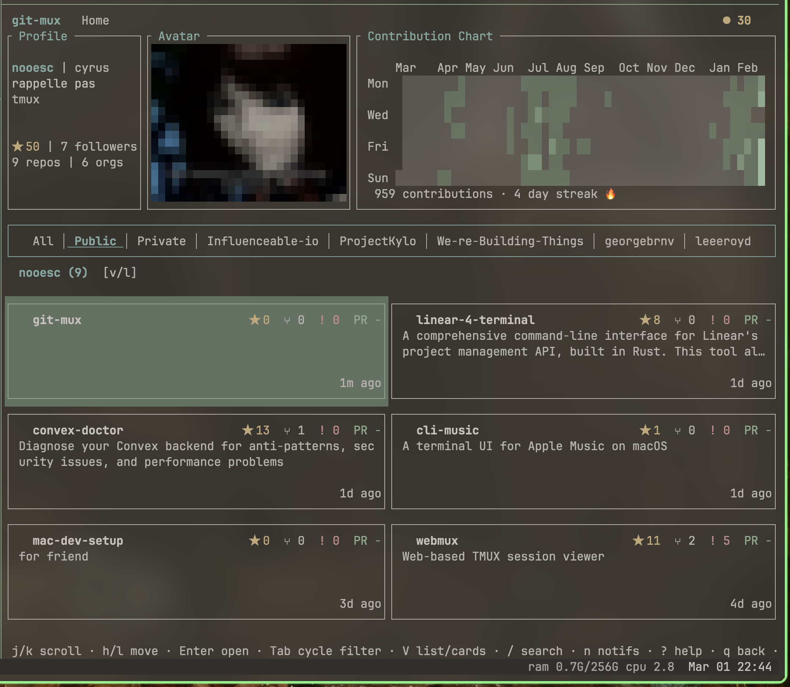
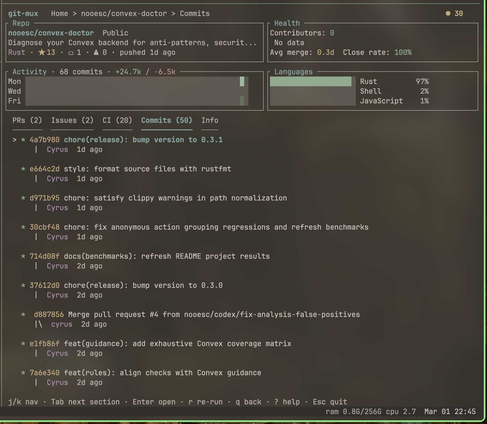

> **WIP** — This project is under active development and not yet feature-complete. Expect rough edges, missing functionality, and breaking changes.

# git-mux

A terminal UI dashboard for GitHub. Browse your repos, view commit history, PRs, issues, CI status, and contribution stats — all without leaving the terminal.

Built with Rust and [ratatui](https://github.com/ratatui/ratatui).





## Features

- Profile overview with avatar, bio, and contribution heatmap
- Repository cards with stars, forks, issues, and PR counts
- Filter repos by visibility, org, or search
- Repo detail view with commits, PRs, issues, CI runs, languages, and health metrics
- Notification indicator
- Startup cache for fast reloads
- Config-driven org/repo exclusions

## Setup

Requires a GitHub personal access token. On first run, git-mux will prompt you to enter one, or you can set it via the `GITHUB_TOKEN` environment variable.

```
cargo install --path .
git-mux
```

## Config

Configuration lives at `~/.config/git-mux/config.toml`.

```toml
[exclude]
orgs = ["some-org"]
repos = ["owner/repo-name"]
```

## Keybindings

| Key | Action |
|-----|--------|
| `j/k` `↑/↓` | Navigate up/down |
| `h/l` `←/→` | Navigate left/right |
| `Enter` | Open repo detail |
| `Tab` | Cycle filter / section |
| `v` | Toggle list/card view |
| `/` | Search |
| `n` | Notifications |
| `o` | Open in browser |
| `r` | Re-run CI |
| `q` | Back / quit |
| `?` | Help |
